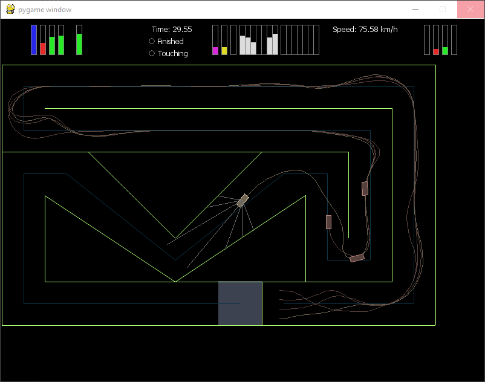

# Race environment for nlab

Require: [pynlab](https://github.com/Apostol3/pynlab),
[Box2D](https://github.com/pybox2d/pybox2d),
[pygame](http://www.pygame.org/download.shtml)

````
usage: python main.py [-h] [-p name] [-c n] [--no-gui] [file]

positional arguments:
  file                  map file (default: default.json)

optional arguments:
  -h, --help            show this help message and exit
  -p name, --pipe name  pipe name (default: nlab)
  -c n, --count n       number of players (default: 25)
  --no-gui              do not show gui

````

Also you can launch in "manual" mode. To do this run `race_env.py` file.
Controls - Arrow keys. Press Enter to restart environment.

````
usage: python race_env.py [-h] [file]

positional arguments:
  file        map file (default: default.json)

optional arguments:
  -h, --help  show this help message and exit
````

###Screenshot of custom map:
